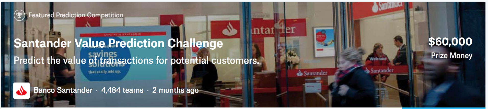

# Kaggle/Santander Value Prediction

<div align="center">
  <br><br>
</div>

## Abstract
[Kaggle Santander Value Prediction Competition](https://www.kaggle.com/c/santander-value-prediction-challenge)

- Host : **Santander**, British bank, wholly owned by the Spanish Santander Group.
- Prize : $ 60,000
- Problem : Regression
- Evaluation : Root Mean Squared Log Error
- Period : June 19 2018 ~ Aug 21 2018 (63 days)

**Santander Bank** aims to predict the value of the transactions for each potential customers.

Competition data is completely anonymized, and size of the train set is quite small (~4k rows). Given the task, anonymized data must be a time-series data encrypted in specific method. Kagglers have identified a data leakage (or specifically how the data has been encrypted) and utilized the lag data which is often a strong predictor in time-series. Top scoring methods must include data leakage information, otherwise the score is too low to compete. 

I share a baseline method, with no Feature Engineering and simple RandomForest regressor.
I conduct simple feature engineering ideas and use LightGBM model for next version.
Additional feature engineering ideas and using XGBoost and CatBoost further pushes the score to around Private LB 1.37
Next, we use leakage data to obtain better Private LB scores.

I have decided to accept the nature of data leakage in Kaggle competition. Instead of avoiding competitions that include leakage, I would like to learn how kagglers have found the leakage and explored the leakage, as they are the product of extensive data exploration, which I admire in terms of skill-set.


## Result
| Submission | CV LogLoss | Public LB | Rank | Private LB | Rank |
|:----------:|:----------:|:---------:|:----:|:----------:|:----:|
| baseline | - | 1.93257 | - | 1.87086 | 
| [Exp 01] Feature Selection & Feature Interaction + LightGBM | - | 1.57676 | - | 1.53769 | 
| [Exp 02] Feature Selection & PCA & Statistical features + CatBoost/XGBoost/LightGBM | - | 1.41484 | - | 1.37273
| leakage model | - | - | - | - | 


## How to Run
```
# for baseline,
python code/baseline.py

# for [Exp 01], follow
code/[LB 1.53769] [FE] feature selection, feature interaction [Model] LightGBM.ipynb

# for [Exp 02], follow
code/[LB 1.37246] [FE] feature selection, pca, statistical features [Model] Catboost, XGBoost, LightGBM.ipynb

# for leakage model,
# (python version of leakage model is very slow (about 8+ hours) due to pandas merge op over [40k, 4k] x [40k, 4k] in Line 68
python code/leakage_model.py
```

## What I've learnt
- experienced porting R code into Python code. R code does perform faster in merge operations. I conducted profiling to optimize Python code, but could not resolve bottleneck of pandas merge on multiple columns. Cudos to Jack for his elegant and efficient code!
- improved pandas skills while porting to Python, especially on `pd.merge()`
- lessons learnt : anonymized data with leakage has little room for feature engineering. still amazed how Giba and other kagglers found the initial clue to the leakage.
